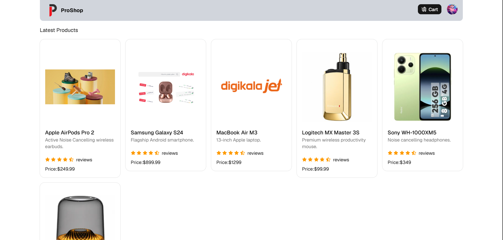
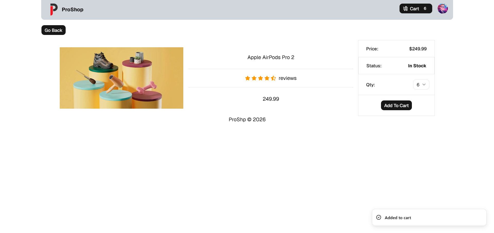
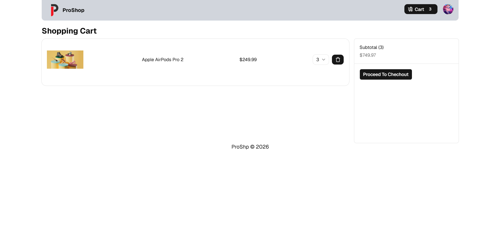
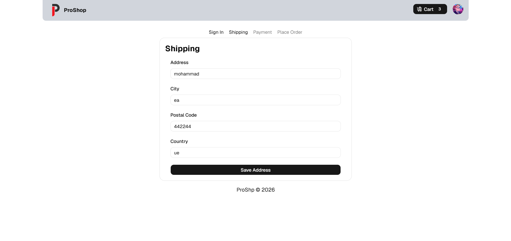
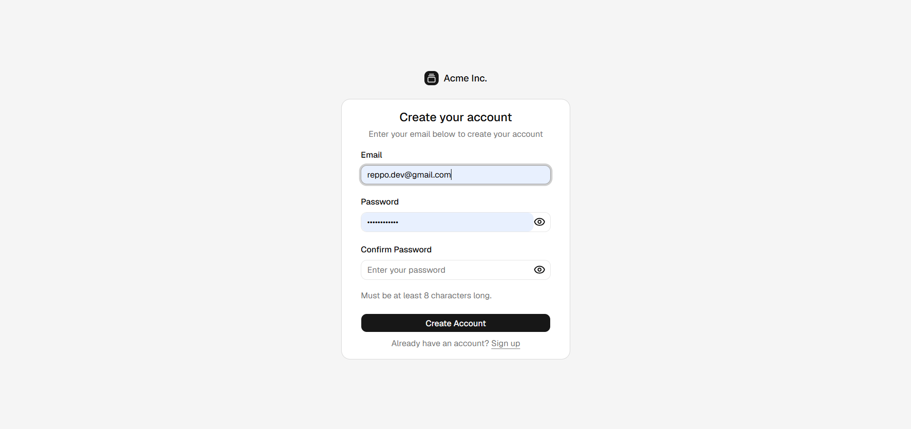
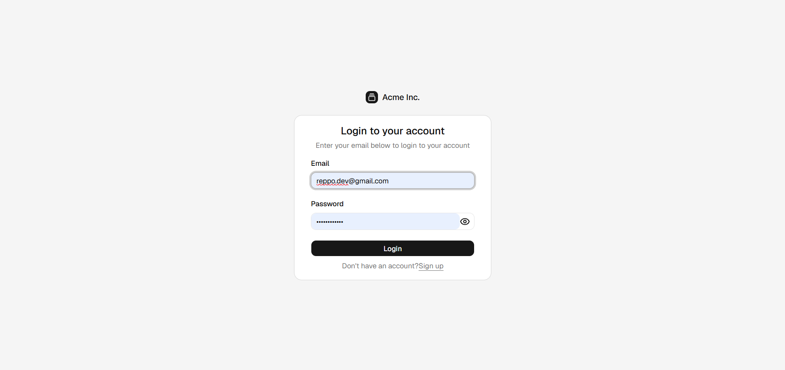
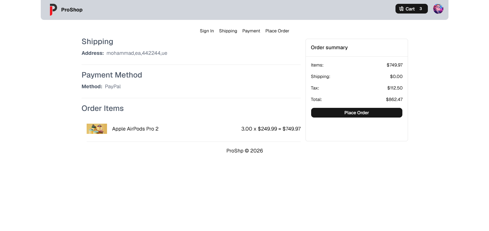
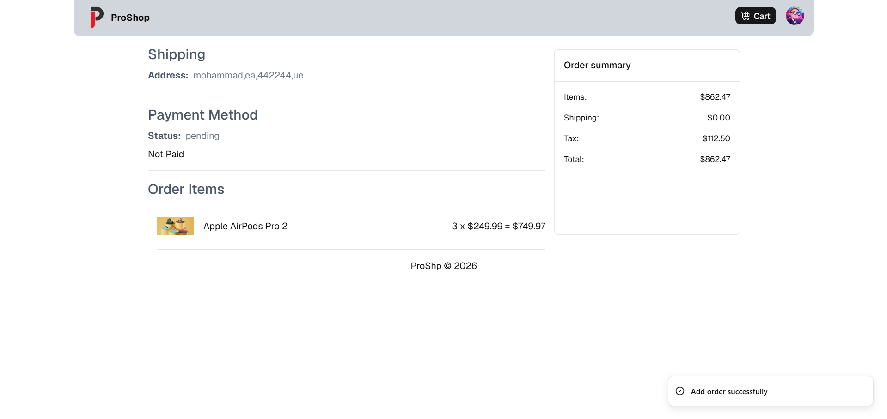

# ProShop

ProShop is a full-stack e-commerce web application for browsing products, managing a shopping cart, and completing checkout with user authentication. It includes a React frontend and a Go REST API backed by PostgreSQL.

## Screenshots

| Home                              | Product Details                                   |
| --------------------------------- | ------------------------------------------------- |
|  |  |

| Shopping Cart                         | Shipping                                     |
| ------------------------------------- | -------------------------------------------- |
|  |  |

| Register                             | Login                          |
| ------------------------------------ | ------------------------------ |
|  |  |

| Place Order                                | Order Details                          |
| ------------------------------------------ | -------------------------------------- |
|  |  |

## Features

- **Product catalog** — Browse latest products on the home page with ratings and prices
- **Product details** — View full product info, select quantity, and add items to cart
- **Shopping cart** — Update quantities, remove items, and see subtotal
- **User authentication** — Register, login, and logout with JWT stored in HTTP-only cookies
- **Checkout flow** — Multi-step process: Shipping → Payment → Place Order
- **Order management** — Create orders and view order details after checkout
- **Protected routes** — Checkout pages require authentication

## Tech Stack

### Frontend (`frontend/`)

| Technology                | Purpose                        |
| ------------------------- | ------------------------------ |
| React 19 + TypeScript     | UI framework                   |
| Vite                      | Build tool and dev server      |
| Redux Toolkit + RTK Query | State management and API calls |
| React Router v7           | Client-side routing            |
| Tailwind CSS 4            | Styling                        |
| shadcn/ui + Radix UI      | UI components                  |
| React Hook Form + Zod     | Form validation                |
| Sonner                    | Toast notifications            |

### Backend (`backend/`)

| Technology | Purpose                            |
| ---------- | ---------------------------------- |
| Go 1.25    | Server language                    |
| Fiber v3   | HTTP framework                     |
| GORM       | ORM for PostgreSQL                 |
| PostgreSQL | Database                           |
| JWT        | Authentication (HTTP-only cookies) |
| bcrypt     | Password hashing                   |

## Project Structure

```
proshop/
├── backend/
│   ├── controller/     # Route handlers (auth, products, cart, orders, address)
│   ├── database/       # DB connection and migrations
│   ├── models/         # GORM models
│   ├── router/         # API routes
│   ├── utils/          # JWT helpers
│   └── main.go
├── frontend/
│   ├── src/
│   │   ├── components/ # Reusable UI (Header, ProductCard, CheckoutSteps, ...)
│   │   ├── screens/    # Page components
│   │   ├── redux/      # Store, slices, and RTK Query APIs
│   │   └── interface/  # TypeScript types
│   └── ...
└── screanshot/         # App screenshots
```

## Getting Started

### Prerequisites

- [Node.js](https://nodejs.org/) (v22+)
- [pnpm](https://pnpm.io/)
- [Go](https://go.dev/) (1.25+)
- [PostgreSQL](https://www.postgresql.org/)

### 1. Clone the repository

```bash
git clone https://github.com/<your-username>/proshop.git
cd proshop
```

### 2. Backend setup

Create a `.env` file inside `backend/`:

```env
dns=host=localhost user=postgres password=yourpassword dbname=proshop port=5432 sslmode=disable
```

Then run the API server:

```bash
cd backend
go mod download
go run main.go
```

The backend runs at **http://localhost:8000**.

### 3. Frontend setup

In a separate terminal:

```bash
cd frontend
pnpm install
pnpm dev
```

The frontend runs at **http://localhost:5173**.

## API Endpoints

| Method   | Endpoint              | Description                    |
| -------- | --------------------- | ------------------------------ |
| `POST`   | `/register`           | Create a new user account      |
| `POST`   | `/login`              | Sign in and receive JWT cookie |
| `POST`   | `/logout`             | Clear auth cookie              |
| `GET`    | `/products`           | List all products              |
| `GET`    | `/product/:id`        | Get product by ID              |
| `GET`    | `/getcart`            | Get current user's cart        |
| `POST`   | `/addtocart`          | Add item to cart               |
| `PUT`    | `/updatecartitem/:id` | Update cart item quantity      |
| `DELETE` | `/deletecartitem/:id` | Remove item from cart          |
| `PUT`    | `/createaddress`      | Save shipping address          |
| `GET`    | `/useraddress`        | Get user's saved address       |
| `POST`   | `/createorder`        | Place a new order              |
| `GET`    | `/allorder`           | List all orders                |
| `GET`    | `/alluserorder`       | List orders for logged-in user |
| `GET`    | `/userorder/:id`      | Get a specific order           |

## Routes (Frontend)

| Path           | Screen                 | Auth required |
| -------------- | ---------------------- | ------------- |
| `/`            | Home — product listing | No            |
| `/product/:id` | Product details        | No            |
| `/cart`        | Shopping cart          | No            |
| `/login`       | Login                  | No            |
| `/sign-up`     | Register               | No            |
| `/shipping`    | Shipping address       | Yes           |
| `/payment`     | Payment method         | Yes           |
| `/place-order` | Order review & submit  | Yes           |
| `/order/:id`   | Order confirmation     | Yes           |

## License

This project is open source and available for personal and educational use.
